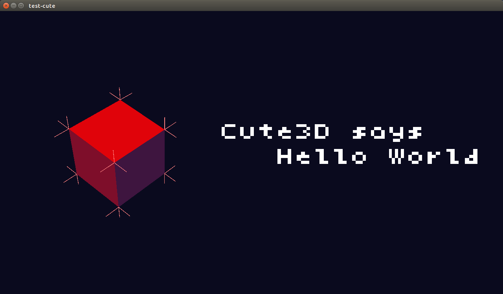
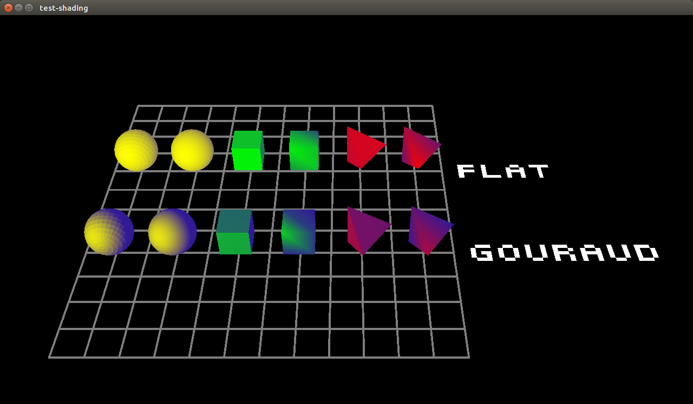
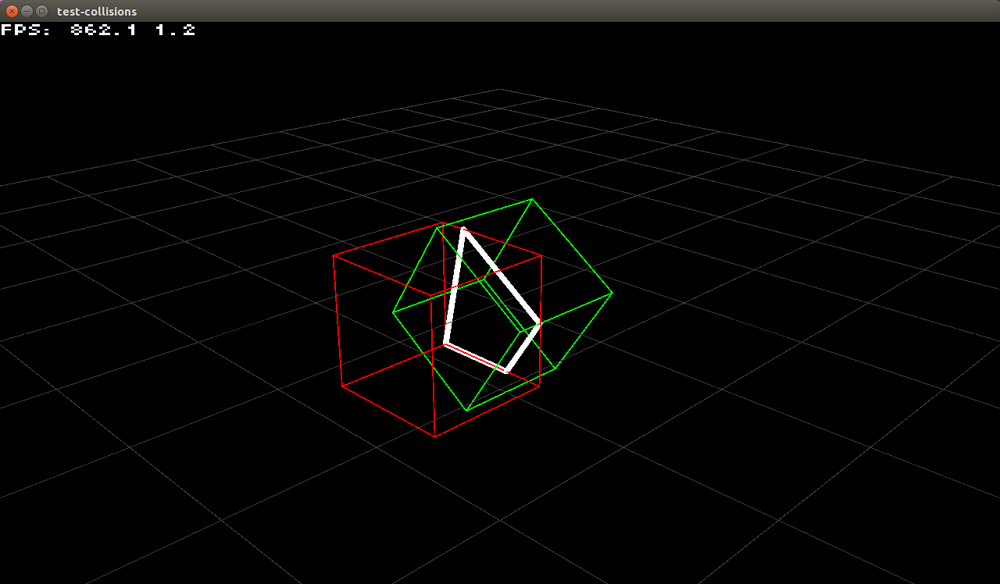
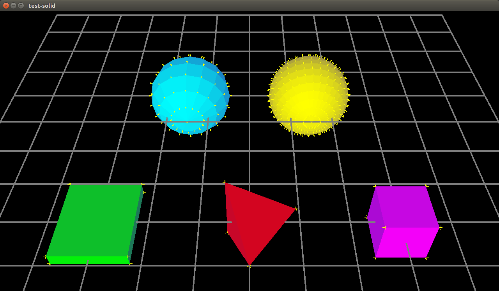
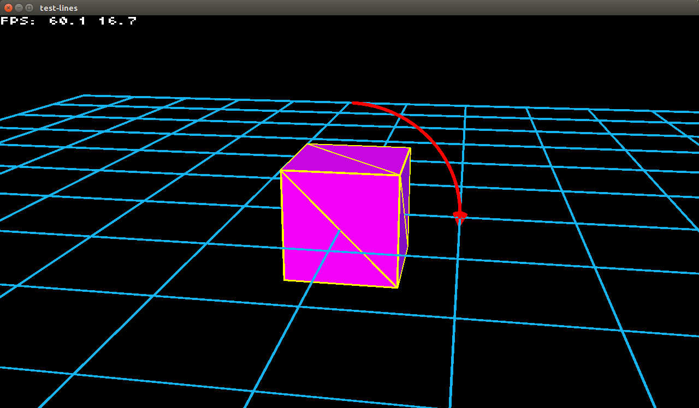

#Cute3D

This is a framework for developing interactive realtime simulations in 3D, also known as videogames. It is a private project currently in development and useable, but very far away from being complete. My goal is to create a library of functionality that makes it easy to quickly prototype and implement interactive 3D applications. That means ultimately I want this framework to offer implementations touching various topics of game development, starting from simple rendering, ranging over acceleration structures, collision detection and occlusion culling, all the way to physics simulation, animation and procedural generation.

  
 

## Getting Started

Currently Cute3D can be used as a simple OpenGL rendering library, that helps you getting something on the screen without running into the 'black screen' problem programmers often face when first beginning with OpenGL. Despite the fact that I call Cute3D a library, it does not yet build as a shared library. Instead, the best way to get started with Cute3D is to just clone the repository, build the included tests and start experimenting with the source code directly:

    git clone https://github.com/rakete/cute3d.git
    cd cute3d

Cute3D tries to have as few dependencies as possible, it only needs SDL2, python, the ninja build system and a C99 compiler. If you are running Ubuntu Linux you can use the following command to install everything neccessary to build Cute3D:

    sudo apt-get install libsdl2-dev ninja-build python gcc

If you are using any other Linux distribution or Microsoft Windows, you have to make sure these dependencies are correctly installed and accessible from the shell in which you are attempting to build Cute3D.

Once you have everything neccessary installed you can build Cute3D. Make sure you are inside the cloned cute3d repository and execute the following commands:

    mkdir build
    cd build
    python ../ninja_build.py

This should output a brief summary of build settings in your terminal. If you are building on Windows make sure the paths shown for the location of the SDL2 include headers and library files are correct! If these are not correct, you have to edit ninja_build.py to contain the correct paths and then run the last command again.

The python command should have generated a build.ninja file in your build/ directory. You should now be able to build the Cute3D files by just executing:

    ninja

Or to build Cute3D together with a few tests you can execute:

    ninja test-collisions test-cute test-halfedge test-lines test-shading test-solid

Which should produce executables in the current directory, named with the suffix .bin on Linux and .exe on Windows.

Run any of them to see Cute3D in action. Most tests have some basic camera controls. Holding left mouse button while moving the mouse rotates the camera, holding right mouse button while moving the mouse pans the camera and using the mouse wheel zooms the camera in and out.

## Future Plans

where is this whole project going?

### Geometry
* bsp
* cs
* approximate convex decomposition
http://masc.cs.gmu.edu/wiki/ACD
* skeletal animation
http://cs.gmu.edu/~jmlien/research/app-cd/skeletonization/index.html
* collision response

### Rendering
* shadows
* phong shading
